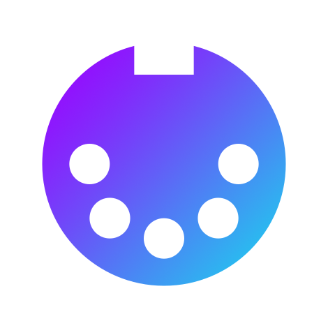

  
  <h1>anyMidi</h1>

anyMidi converts audio into MIDI notes with the help of FFT and harmonic analysis.
Work on this project started as a part of my bachelor thesis in the field of music technology at the [Norwegian University of Science and Technology (NTNU)](https://www.ntnu.edu/), Trondheim, Norway.

## Documentation

Doxygen documentation is built to the branch [doxygen_pages](https://github.com/EwanMe/anyMidi/tree/doxygen_pages), and can be viewed at [ewanme.github.io/anymidi](https://ewanme.github.io/anyMidi).

## Build

### Requirements

The JUCE framework is required to build this project. Downloaded from: https://juce.com/get-juce/download

For Windows, the ASIO SDK can be used to reduce latency. Download from: https://www.steinberg.net/developers/

### CMake

This project is built with CMake, and the Projucer file commonly used with JUCE projects is not maintained.
Reference either the JUCE source code with `-DJUCE_PATH` or an install of the JUCE library with `-DCMAKE_PREFIX_PATH`.

When building with ASIO, use the vaiable `-DASIO_SDK_PATH=<path to ASIO>/common`.
The JUCE source code does not enable ASIO functionality by default.
To enable it, change the value of `JUCE_ASIO` to 1 in the file `juce_audio_devices.h` of the JUCE source code.

Example of configuration:

`cmake -G Ninja -DCMAKE_BUILD_TYPE=Debug -DJUCE_PATH=<path to JUCE> -S<path to anyMidi> -B<path to build folder>`

Build with:

`cmake --build <path to build folder>`

## Running anyMidi

To run **anyMidi** there is need for a separate driver for routing MIDI from **anyMidi** to your DAW or other app.
For Windows **LoopBe1** has been tested during development and can be downloaded here: https://www.nerds.de/en/download.html

LoopBe1 (or similar) and your DAW needs to be running when anyMidi is in use.
From the anyMidi audio settings tab, audio input can be selected and the MIDI output needs to be LoopBe1.
In your DAW, select LoopBe1 as a MIDI input.
Now you should be able to produce MIDI in you DAW by playing on your connected instrument!
